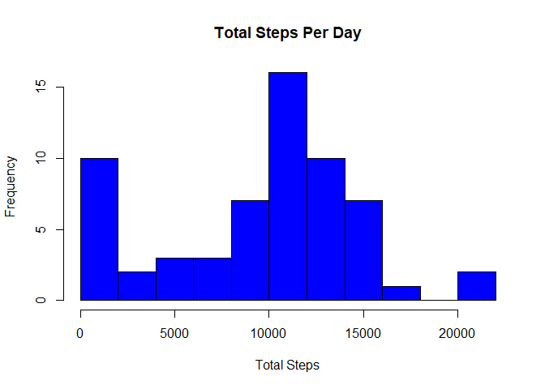
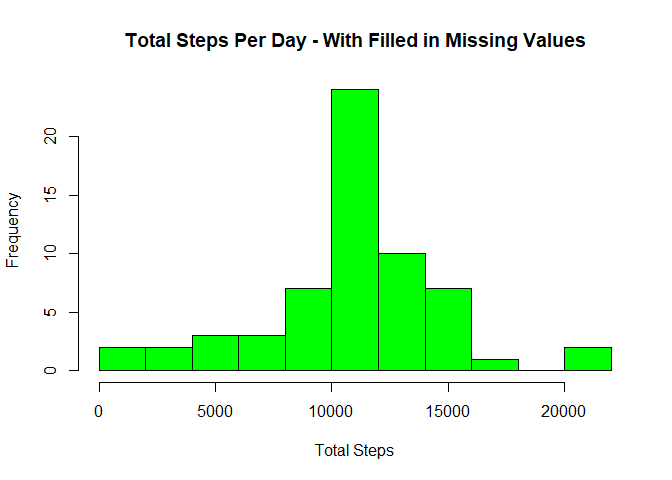
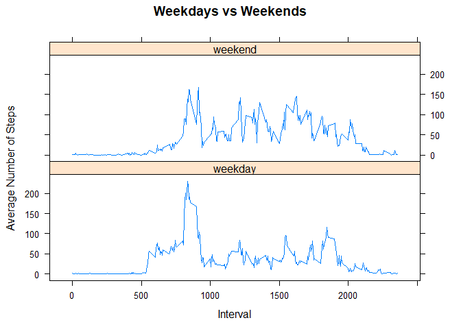

# Reproducible Research - Activity Analysis
Ffion Fletcher  
July 29, 2017  

##This document will outline the steps taken to answer the questions for this assignment.


The libraries to be used in this analysis are first loaded.

```r
library(dplyr)
library(lattice)
```


The data set is then read into R

```r
activity <- read.csv("activity.csv", header= TRUE)
```


###What is the mean total number of steps taken per day?

*1. Calculate the total number of steps taken per day then create a histogram to show this relationship*

```r
totalsteps <- activity %>% group_by(date) %>% summarise(total = sum(steps, na.rm = TRUE))

hist(totalsteps$total, main = "Total Steps Per Day", xlab = "Total Steps", col = "blue", breaks = 15)
```

<!-- -->


*2. Calculate the mean and median of the total number of steps taken per day* 

```r
meansteps <- mean(totalsteps$total)
mediansteps <- median(totalsteps$total)
```

The mean steps taken per day is **9354.2295082** and the median steps taken per day is **10395**.


###2 - What is the average daily activity pattern?

*1. A time series plot is created of the 5-minute interval (x-axis) and the average number of steps taken, averaged across all days (y-axis)*


```r
activity$date <- as.Date(activity$date)
act2 <- activity %>% group_by(interval) %>% summarise(meansteps = mean(steps, na.rm = TRUE))
with(act2, plot(interval, meansteps, type = "l", xlab = "Interval", ylab = "Average Steps",
               main = "Average Steps per Interval"))
```

<!-- -->


*2. Which 5-minute interval, on average across all the days in the dataset, contains the maximum number of steps?*

```r
maxinterval <- filter(act2, meansteps == max(act2$meansteps, na.rm=TRUE))
maxinterval <- maxinterval[,1]
```

The 5-minute interval that contains the maximum number of steps is **835**.


###3 - Imputing Missing Values

*1. calculate the total number of missing values that are present in the dataset*

```r
totalna <- sum(is.na(activity$steps))
```

The total number of missing values in the dataset is **2304**.


*2. Fill in each missing value with the average number of steps per interval*

```r
a2 <- activity
a2$steps <- ifelse(is.na(a2$steps), act2$meansteps, a2$steps)
```


*3. Create a histogram of the total number of steps taken each day*


```r
dailysteps <- a2 %>% group_by(date) %>% summarise(total = sum(steps, na.rm = TRUE))

hist(dailysteps$total, main = "Total Steps Per Day - With Filled in Missing Values",
     xlab = "Total Steps", col = "green", breaks = 15)
```

<!-- -->

*4. Calculate and report the mean and median total number of steps taken per day.* 

```r
meansteps2 <- mean(dailysteps$total)
mediansteps2 <- median(dailysteps$total)
```

After imputing the missing values, the mean steps per day is **10766.19** and the median steps taken per day is **10766.19**.

*Do these values differ from the estimates from the first part of the assignment?*

Yes, the mean and median are different from what was calculated in the first part of the assignment. These were **9354.2295082** and **10395** respectively.


*5. What is the impact of imputing missing data on the estimates of the total daily number of steps?*

The impact of imputing missing data is that the mean and median values are changed, and in this case, increased.


##Are there differences in activity patterns between weekdays and weekends?


```r
a2$wkday_wkend <- ifelse(weekdays(a2$date) %in% c("Saturday", "Sunday"), "weekend", "weekday")
a2$wkday_wkend <- as.factor(a2$wkday_wkend)
act3 <- a2 %>% group_by(interval, wkday_wkend) %>% summarise(meansteps = mean(steps, na.rm = TRUE))

xyplot(meansteps ~ interval | wkday_wkend, data = act3, type = "l", layout = c(1,2), xlab = "Interval", ylab = "Average Number of Steps", main = "Weekdays vs Weekends")
```

<!-- -->


Yes, there is a clear difference in the activity patterns for weekdays versus weekends.
